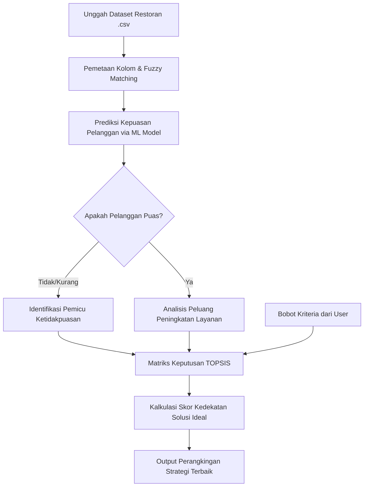

# Sistem Rekomendasi Strategi Kepuasan Pelanggan Restoran (DSS)

Sistem Pendukung Keputusan (Decision Support System - DSS) interaktif berbasis web yang dirancang untuk membantu pengelola restoran menganalisis data pelanggan, memprediksi tingkat kepuasan menggunakan Machine Learning (ML), dan merekomendasikan strategi perbaikan layanan yang optimal menggunakan metode **TOPSIS** (*Technique for Order of Preference by Similarity to Ideal Solution*).

Aplikasi ini dibangun menggunakan **Streamlit**, **Pandas**, **Numpy**, dan **Scikit-Learn** untuk memudahkan pemangku kepentingan dalam mengambil keputusan berbasis data (*data-driven decision*) guna meningkatkan loyalitas dan retensi pelanggan restoran.

---

## Fitur & Kapabilitas Utama Sistem

Dengan aplikasi ini, Anda dapat melakukan analisis mendalam dan melihat berbagai visualisasi menarik:

1. **Dashboard Analisis & Statistik Deskriptif**
   - Menampilkan ringkasan eksekutif data pelanggan (distribusi usia, pendapatan, rata-rata pengeluaran, waktu kunjungan, dan preferensi menu).
   - Visualisasi distribusi kepuasan pelanggan aktual berdasarkan data historis yang diunggah.

2. **Integrasi Model Prediksi Machine Learning**
   - Melakukan prediksi kepuasan pelanggan secara otomatis berdasarkan fitur demografi, perilaku kunjungan, dan rating layanan menggunakan model klasifikasi ML (`model_satisfied_v2.pkl`).
   - Fitur pencocokan kolom otomatis (*automatic feature mapping*) dengan teknologi fuzzy matching jika nama kolom dataset Anda berbeda dari standar model.

3. **Rekomendasi Strategi Berbasis TOPSIS**
   - Perangkingan otomatis dari 20+ strategi bisnis (seperti diskon mahasiswa, program loyalitas, optimasi waktu tunggu, pelatihan staf, hingga penyesuaian menu).
   - Penilaian kedekatan relatif (*closeness score*) terhadap solusi ideal positif dan negatif untuk memberikan rekomendasi prioritas tindakan terbaik secara transparan.

4. **Simulasi Bobot Kriteria Interaktif**
   - Pengguna dapat menyesuaikan bobot kepentingan untuk setiap kategori kriteria (Demografi, Perilaku Kunjungan, Kualitas Layanan, Keuangan, dll.) secara interaktif melalui sidebar.

5. **Panduan Penggunaan Terintegrasi**
   - Halaman panduan langkah demi langkah (*User Guide*) di dalam aplikasi untuk membantu pengguna memahami cara kerja sistem, format data, dan interpretasi hasil rekomendasi.

---

## Struktur Direktori Proyek

Proyek ini terorganisasi dengan struktur yang modular agar mudah dipelihara dan dikembangkan:

```
RestaurantDecisionSupportSystem/
│
├── app.py                  # Entry point utama aplikasi Streamlit
├── topsis_utils.py         # Modul inti komputasi algoritme TOPSIS
├── data_mapping.py         # Logika pemetaan data, fuzzy matching kolom, dan ekstraksi fitur
├── ui_components.py        # Komponen antarmuka (styling CSS kustom, kartu metrik, dashboard)
│
├── model_satisfied_v2.pkl  # Serialisasi model Machine Learning (Predictive Model)
├── feature_names.pkl       # List nama fitur input yang digunakan oleh model ML
│
├── requirements.txt        # Daftar pustaka/dependencies Python
│
├── restaurant_customer_satisfaction.csv  # Dataset latih / dataset sampel utama
├── restaurant_customers (3).csv          # Contoh file data untuk pengujian upload
│
├── Laporan Teknis_230012_230062_230076.pdf  # Dokumentasi laporan ilmiah proyek
├── Poster_230012_230062_230076.pdf           # Publikasi poster visual proyek
└── README.md               # Dokumentasi sistem (File ini)
```

---

## Panduan Instalasi & Penggunaan

Ikuti langkah-langkah di bawah ini untuk menjalankan aplikasi di lingkungan lokal Anda:

### Prasyarat (Prerequisites)
Pastikan Anda sudah menginstal **Python 3.8** atau versi yang lebih baru di sistem Anda.

### Langkah 1: Kloning Repositori
Buka terminal atau command prompt, lalu jalankan perintah berikut:
```bash
git clone https://github.com/username/RestaurantDecisionSupportSystem.git
cd RestaurantDecisionSupportSystem
```

### Langkah 2: Instalasi Dependencies
Instal semua pustaka Python yang diperlukan menggunakan file `requirements.txt`:
```bash
pip install -r requirements.txt
```

### Langkah 3: Menjalankan Aplikasi Streamlit
Jalankan server Streamlit lokal Anda dengan perintah berikut:
```bash
streamlit run app.py
```
Setelah berhasil dijalankan, aplikasi akan otomatis terbuka pada peramban web Anda di alamat: `http://localhost:8501`.

---

## Arsitektur Model & Alur Keputusan AI

Sistem ini menggabungkan kekuatan analitik prediktif (*Machine Learning*) dengan sistem pengambilan keputusan multi-kriteria (*TOPSIS*) untuk menghasilkan rekomendasi yang presisi.

### Skema Alur Pemrosesan Data



### Penjelasan Komponen Arsitektur AI

1. **Layer Prediksi (Machine Learning Classifier):**
   - Menggunakan model klasifikasi biner yang telah dilatih sebelumnya (`model_satisfied_v2.pkl`) dengan input berupa profil demografi pelanggan, pola kunjungan, dan evaluasi rating.
   - Model memprediksi tingkat kepuasan pelanggan (`Satisfied` vs `Unsatisfied`).

2. **Layer Pemetaan Strategi & Fitur (Data Mapping):**
   - Menghubungkan fitur-fitur penting pelanggan dengan 20+ strategi perbaikan potensial.
   - Jika suatu fitur (misalnya, `WaitTime`) berkorelasi negatif dengan kepuasan pelanggan pada data yang diunggah, maka bobot kepentingan strategi penanganan waktu tunggu (`A3: Optimasi Sistem Antrean dan Kecepatan Penyajian`) secara dinamis disesuaikan dalam matriks keputusan.

3. **Layer Pengambilan Keputusan (TOPSIS Engine):**
   - **Kriteria Evaluasi:** Terbagi atas kelompok kriteria keuntungan (*Benefit*, di mana nilai yang lebih tinggi dinilai lebih baik, seperti rating makanan) dan biaya (*Cost*, di mana nilai yang lebih rendah dinilai lebih baik, seperti waktu tunggu pelanggan).
   - **Normalisasi Matriks:** Mengonversi performa relatif dari tiap strategi ke dalam skala seragam.
   - **Output:** Menghitung jarak relatif ke solusi ideal terbaik ($A^+$) dan solusi ideal terburuk ($A^-$) untuk mengurutkan strategi bisnis dari yang paling direkomendasikan hingga yang paling tidak prioritas.
